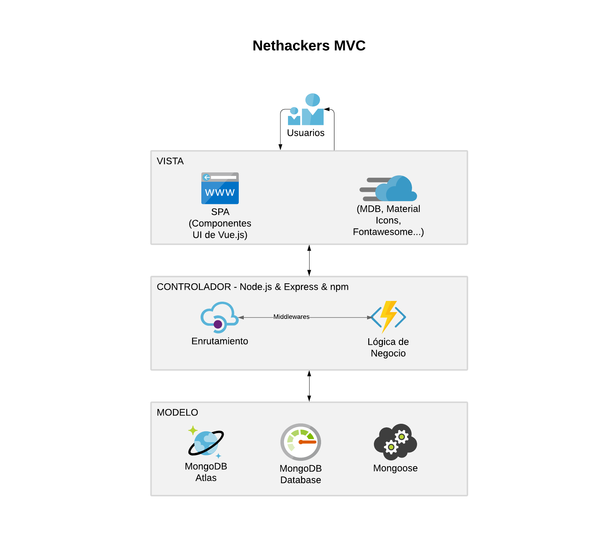
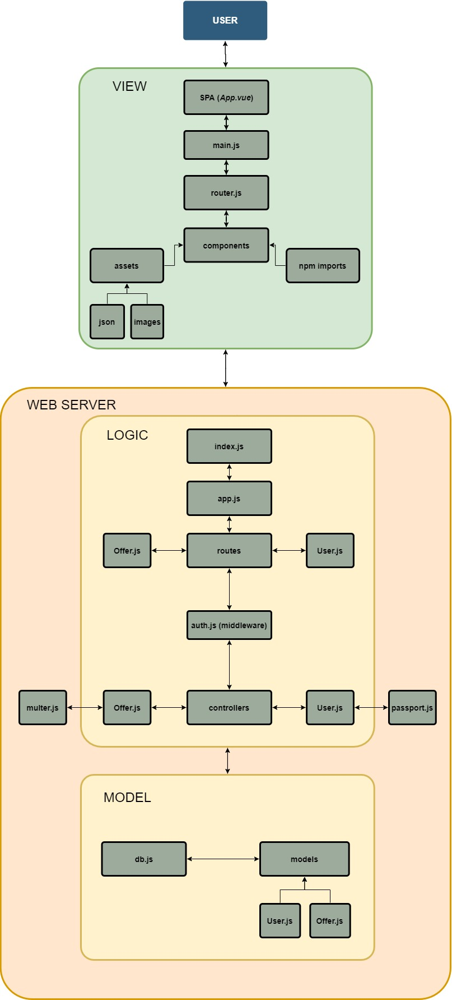
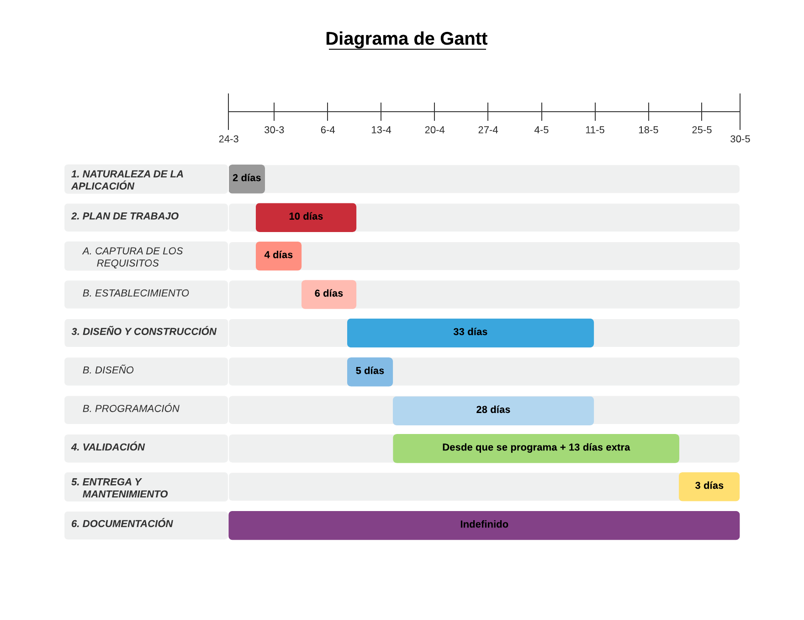
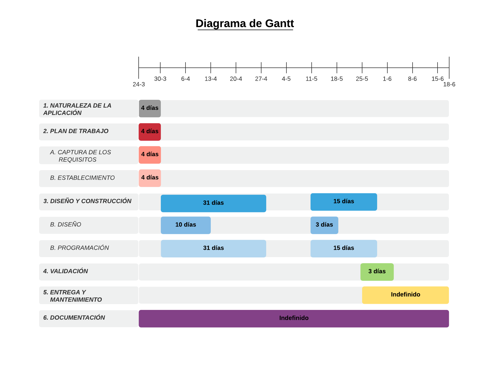

# Nethackers-CFP

The final project at the end of DUAL Web Applications Development course.

## Índice

1. [Historias de usuario](#id-user)

2. [Arquitectura de la aplicación](#id1)

   2.1. [Tecnologías usadas](#id1-1)

3. [Diagrama de componentes](#id2)

4. [Diagramas de Gantt](#id3)

5. [Clockify](#id4)

6. [Presupuesto](#id5)

## Historias de usuario

- Como usuario, quiero poder aplicar a una vacante de empleo sin la necesidad de tener que registrarme en Nethackers.

- Como usuario, quiero poder visualizar el listado de todas las vacantes actuales dentro de la web de Nethackers.

- Como usuario reclutador, quiero poder registrarme en Nethackers y postular nuevas vacantes de empleo.

- Como usuario reclutador, quiero poder editar o eliminar las posibles vacantes que yo haya publicado.

- Como usuario reclutador, quiero poder visualizar el total de aplicantes a una vacante de empleo postulada por mí, junto con los detalles de cada aplicante por separado.

- Como usuario reclutador, me interesa poder disponer de un panel de administración sobre mi perfil en Nethackers para introducir datos personales relevantes.

## Arquitectura de la aplicación

La arquitectura establecida para el desarrollo de **Nethackers** ha sido la de **MVC** (*Modelo, Vista, Controlador*). Propone la construcción de tres componentes distintos que son el modelo, la vista y el controlador, es decir, por un lado define componentes para la gestión de la información, y por otro lado para la interacción del usuario.

Teniendo en cuenta este patrón de diseño, nuestra arquitectura queda así:

A continuación, se explica cada una de las diferentes capas y sus componentes correspondientes.

**Modelo**: se encarga de gestionar el acceso a los datos, asi como su manejo. Para ello, en Nethackers se han usado las siguientes tecnologías:

1. _MongoDB_: base de datos NoSQL orientada a documentos JSON.

2. _MongoDB Atlas_: sistema en la nube que nos permitirá disponer de una base de datos MongoDB de forma gratuita.

3. _Mongoose_: una biblioteca de modelado de datos de objetos (_ODM_) para MongoDB y Node.js. Gestiona las relaciones entre los datos, proporciona validación de esquema y se utiliza para traducir entre objetos en código y la representación de esos objetos en MongoDB.

**Controladores**: cada uno de los diferentes archivos Javascript se encargará de procesar las peticiones y respuestas del back-end, respectivamente hacia sus modelos relacionados.

1. _Offer.js_: archivo Javascript que llevará el control de las peticiones relacionadas con las ofertas de Nethackers.

2. _User.js_: archivo Javascript el cual gestionará todo lo relacionado con los usuarios de Nethackers.

**Vista**: supone la representación gráfica de los datos. Es aquí donde el usuario interactuará con ellos y, según los eventos lanzados por él, se gestionarán los datos de forma acorde.

1. _Vue.js_: framework de desarrollo front-end apra Javascript. Supone una curva de aprendizaje muy pequeña. Destaca por su sencillez y gran comunidad de desarrolladores aportando nuevas funcionalidades.

[_Volver al índice_](#indice)

### Tecnologías usadas

#### Back-end

1. _Node.js_:
   - Compatibilidad con el gestor de paquetes npm, ya viniendo integrado en él una vez se instala el entorno de desarrollo.
   - Provee de manifiestos llamado package.json y package-lock.json, los cuales indican qué dependencias, qué versiones, qué scripts y qué datos esenciales pertenecen al proyecto y a su desarrollo. 
      - Estos manifiestos servirán como reflejo de las dependencias npm que se instalarán a lo largo del desarrollo del proyecto, y por tanto no se mencionan aquí expresamente.

2. _Express_:
   - Provee una infraestructura de aplicaciones web mínima y flexible que proporciona un conjunto sólido de características para las aplicaciones web y móviles.
   - API: con miles de métodos de programa de utilidad HTTP y middleware a su disposición, la creación de una API sólida es rápida y sencilla.

3. _Jest_:
   - Configuración sencilla.
   - API básica para testear lo necesario.

4. _MongoDB Atlas_:
   - Configuración inicial mínima para la creación del servidor dedicado.
   - Creado para una óptima construcción de software ya que provee de herramientas de alta escalabilidad y/o rendimiento de la base de datos en tiempo real.
   - La infraestructura está dirigida de forma automática, proveyendo del el setup de la base de datos, el mantenimiento y las mejoras de versión.

5. _Npm_:
   - Permite instala y gestionar paquetes de desarrollo Node de forma rápida.
   - Gran abanico de posibilidades.
   - Gran comunidad manteniéndolo.

[_Volver al índice_](#indice)

#### Front-end

1. _Vue.js_:
   - Fácil de usar teniendo conocimientos previos en HTML, CSS y Javascript.
   - Alto rendimiento:
      - Esfuerzos mínimos de optimización y/o configuración.

2. _Material Design for Bootstrap - Vue_: 
   - Librería para el front-end con una gran gama de componentes únicos y llamativos.
   - Tiene bastantes actualizaciones.
   - Gran soporte.
   - Componentes muy bonitos para el desarrollo de mis vistas.

3. Documentos _HTML_: lenguaje de marcado utilizado mundialmente para el desarrollo de casi todo tipo de web actual. Se encarga de desarrollar una descripción sobre los contenidos que aparecen y sobre su estructura

4. Módulos _Javascript_:
   - Debido al desarrollo con Node.js, el formato de desarrollo estará orientado al lenguaje de programación Javascript.

5. Hojas de estilo con _SCSS_: básicamente ofrece diversas utilidades que a día de hoy no se encuentran en el lenguaje CSS, o bien no son compatibles con todos los navegadores:
   - Ejemplos pueden ser variables, anidación de selectores, funciones (denominadas mixins), etc.

[_Volver al índice_](#indice)

#### Despliegue

1. _Heroku_:
   - La mayor ventaja de usar esta PaaS es la rapidez con la que se puede publicar una aplicación a la nube. Con un comando como `git push heroku master`, la aplicación se sube fácilmente.
   - No hay que invertir tiempo de más en configurar el entorno donde estará desplegada nuestra web. Gran parte de esa configuración es gestionada automáticamente por Heroku.

[_Volver al índice_](#indice)

#### Desarrollo

1. _Clockify_:
   - Realizar el seguimiento del tiempo dedicado a actividades con un clic.
   - Obtener una vista precisa de tu semana de trabajo.
   - Mostrar a los clientes cuánto has trabajado.
   - Ver cómo tu equipo está distribuyendo su tiempo.

2. _Visual Studio Code_:
   - Depuración de código: directamente desde el editor, permite depurar aplicaciones en ejecución con puntos de interrupción, pilas de llamadas y una consola interactiva.
   - Comandos Git incorporados: trabajar con Git es más sencillo. Permite revisar archivos diff, organizar y realizar confirmaciones directamente desde el editor, etc.
   - Extensible y personalizable: Se puede instalar extensiones para agregar nuevos idiomas, temas, depuradores y para conectarse a servicios adicionales. Las extensiones se ejecutan en procesos separados, así pues no ralentizan ningún proceso relacionado con la aplicación.

3. _Sourcetree_:
   - Simple para principiantes: permite interactuar de forma fácil con el control de versiones distribuido con un cliente Git.
   - GUI (graphical user interface): permite unir, con todas las funciones que ofrece, un proceso de desarrollo eficiente y consistente desde el primer momento.

[_Volver al índice_](#indice)

## Diagrama de componentes

[_Volver al índice_](#indice)

## Diagramas de Gantt

### Diagrama de Gantt previo al desarrollo de Nethackers

### Diagrama de Gantt posterior al desarrollo de Nethackers

[_Volver al índice_](#indice)

## Clockify

Véase el apartado `./docs/clockify/clockify_15-06-2020.pdf`

[_Volver al índice_](#indice)

## Presupuesto

Teniendo en cuenta los siguientes datos, el coste total del desarrollo de Nethackers sería de **2.200,2€**:

- Total de horas imputadas: `98:34:09`

- Total de horas facturables: `73:34:09`

- Coste de desarrollo por hora: `30€/h`

En el caso de que el desarrollo de la aplicación continuase y se quisieran expandir sus funcionalidades, convendría adquirir unos mejores servicios tanto en **MongoDB Atlas** como en **Heroku**. Para ello, considero que:

1. En el caso de obtener mejores clusters en MongoDB Atlas:
   - Clusters dedicados (_recomendados_) por `57$/mes`.
     - Para equipos profesionales y de ámbito nacional.
   - Clusters multi-región por `95$/mes`.
     - Para desarrollar aplicaciones internacionalmente accesibles.

2. En el caso de obtener mejores dynos en Heroku:
   - Cabría ir directamente a las opciones *Standard* o *Performance*, las cuales varían en el precio (_`25$-500$` por dyno/mes_)

[_Volver al índice_](#indice)